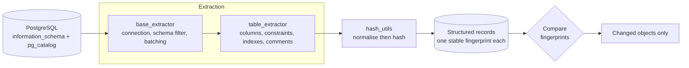

# pg-schema-extractor


Reads PostgreSQL schema metadata out of the catalogues and fingerprints it, so
you can tell what changed between two points in time.

The problem it addresses: `pg_dump --schema-only` gives you a diff, but a
textual diff of a dump is mostly noise. Column ordering shifts, whitespace
varies by server version, and you end up reading three hundred lines to find the
one column that became nullable.

This models schema objects as structured records with a stable hash each, so a
comparison tells you *which object* changed rather than which line moved.

## What it does

`src/extractors/table_extractor.py` pulls tables with their columns, types,
nullability, defaults, constraints, indexes and comments, straight from
`information_schema` and `pg_catalog`.

`src/extractors/base_extractor.py` is the abstract base: connection handling,
schema filtering, batching, and hashing. Extractors for functions, views,
triggers and sequences slot in by subclassing it — the base is built for that,
and those subclasses are the obvious next contribution.

`src/utils/hash_utils.py` produces the fingerprints. Definitions are normalised
before hashing so a whitespace or line-ending difference does not register as a
change. This matters more than it sounds: hash the raw string and a server
upgrade reports every object in the database as modified, and a change report
that cries wolf is one nobody reads.

`src/models/` holds the record types: database objects, detected changes,
notification payloads, and a schema for AI-assisted analysis of a change set.

## How a comparison works



Normalisation before hashing is the whole trick. Hash the raw definition and a
server upgrade reports every object in the database as modified.

## Honest scope

This is the extraction and change-modelling layer, not a finished governance
product.

What is here works: table extraction, hashing, and the data model. The test
suite covers the fingerprint and the hashing rules offline, by building the
record types directly — it does not connect to a server, so the catalogue
queries themselves are exercised by running the extractor, not by CI. What is **not** here is an orchestrator, a
scheduler, notification delivery, or the AI analysis the models describe. The
`ai_analysis` model defines the shape such a component would consume; no such
component ships.

I would rather publish the part that works than a skeleton with an impressive
README. Take this as a library to build on, not an application to run.

## Usage

```python
from src.extractors.table_extractor import TableExtractor

extractor = TableExtractor(
    host="localhost", port=5432,
    dbname="mydb", user="readonly", password="...",
    exclude_schemas=["pg_catalog", "information_schema"],
)
tables = extractor.extract()          # {"public.orders": Table, ...}

for key, table in tables.items():
    print(key, table.hash)
```

`extract()` returns a dict keyed by `schema.name`. Compare those hashes against
a stored baseline to find what moved:

```
  same     public.audit     04087bd6ea8430b7...
  CHANGED  public.orders    9f20a67d5232ea7b...
```

That run followed a single `ALTER TABLE orders ADD COLUMN discount` plus a
dropped NOT NULL. One object changed, one did not, and nothing else in the
database had to be read to know that.

A read-only role is sufficient and is what you should use. Nothing here writes.

## Configuration

`config.yaml` covers connection behaviour, which object types to include,
schemas and patterns to exclude, and the hash algorithm. `.env.example` covers
credentials and notification settings.

`processing.hash_algorithm` defaults to sha256. Changing it invalidates every
stored baseline at once, so treat it as a one-time decision.

## Roadmap

The extraction layer is the foundation for a governance monitor. The design that
sits on top of it, in the order the pieces depend on each other:

**More extractors.** Functions, views, triggers, sequences, constraints and
permissions, each subclassing `BaseExtractor`. This is the immediate next step
and the easiest to contribute.

**Baseline storage.** Persist a snapshot so "what changed" has something to
compare against. A baseline per environment, since staging and production drift
apart and that drift is itself worth reporting.

**Comparison.** Diff current state against a baseline and classify each
difference: added, removed, modified. Object-level via the hashes, then
field-level for the ones that moved.

**Governance policies.** Declarative rules over the extracted metadata: every
table has a primary key, no column stores unencrypted PII, indexes exist on
foreign keys, no permissions granted to PUBLIC. A violation is a policy plus the
object that breaks it.

**Notifications.** Deliver violations somewhere people read: Slack, email, or a
CI exit code. A schema change that introduces a policy violation should be able
to fail a pipeline, not just file a report.

The value is in the last two. Extraction and diffing are solved problems;
encoding *your* organisation's rules about what a schema may look like, and
enforcing them at the point of change, is the part that does not exist off the
shelf.

## License

MIT. See [LICENSE](LICENSE).
